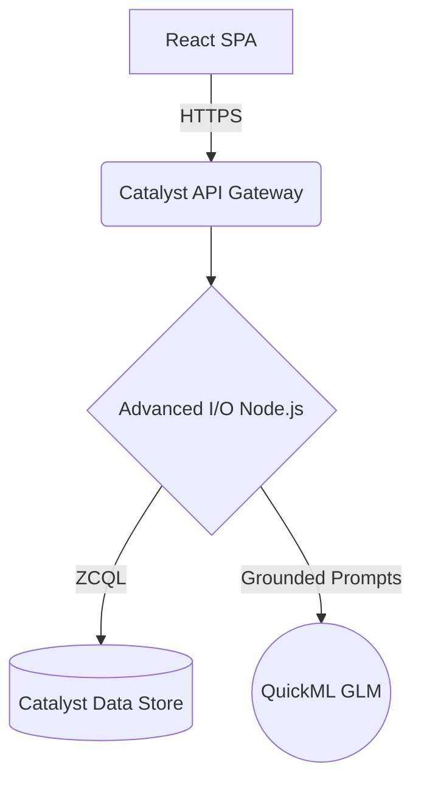

<div align="center">

  <h1>V I K S H A N A</h1>

  <p><b>AI-Powered Investigation Intelligence Platform for Modern Law Enforcement</b></p>


  <br /><br />

  > **[🎥 Watch the Live Demo Video](https://youtube.com/your-demo-link)** &nbsp;&nbsp;|&nbsp;&nbsp; **[🌍 Live Application URL](https://vikshana-60077000408.development.catalystserverless.in/app/index.html)**

  <br/>

</div>

---

## 🚨 Problem Statement

Modern investigations involve fragmented FIRs, evidence records, CCTV logs, vehicle databases, and witness statements spread across multiple systems. Investigators spend valuable time manually correlating information, delaying critical decisions. VIKSHANA transforms these disconnected datasets into a unified AI-powered investigation workspace.

---

## 💡 Solution

```text
Officer ➔ AI Copilot ➔ Evidence Correlation ➔ Relationship Graph ➔ Decision Support ➔ Report Generation
```

---

## ⚖️ Why VIKSHANA?

| Challenge | VIKSHANA |
| :--- | :--- |
| Hundreds of pages to read | **AI summarizes instantly** |
| Manual evidence correlation | **Automatic relationship graph** |
| SQL knowledge required | **Natural Language Search** |
| Manual reports | **One-click AI Briefing** |

---


## 🏗️ Architecture



---

## ⚙️ AI Workflow

```text
Officer ➔ Context Builder ➔ Planner Agent ➔ Catalyst Data Store ➔ QuickML GLM ➔ AI Response ➔ Dashboard / Chat / Report
```

---

## ✨ Core Features

- ✅ **AI Investigation Copilot**
- ✅ **FIR Intelligence**
- ✅ **Relationship Explorer**
- ✅ **Evidence Intelligence**
- ✅ **Neural SQL**
- ✅ **Decision Support**
- ✅ **Automated Reports**

---

## ☁️ Zoho Catalyst Integration

| Service | Usage |
| :--- | :--- |
| **Web Client Hosting** | React Deployment |
| **Advanced I/O** | Backend APIs |
| **Data Store** | Investigation Database |
| **Authentication** | Secure Login |
| **QuickML GLM** | AI Copilot |

---

## 💻 Technology Stack

| Domain | Technology |
| :--- | :--- |
| **Frontend** | React.js, Lucide Icons, `react-force-graph-2d` |
| **Backend** | Node.js, Express.js |
| **Database** | Zoho Catalyst Data Store (ZCQL) |
| **AI** | Zoho QuickML GLM (`crm-di-glm47b_30b_it`) |

---

## 🎬 Demo Flow

```text
Login ➔ Dashboard ➔ Select Case ➔ AI Chat ➔ Relationship Explorer ➔ Evidence ➔ Decision Support ➔ Generate Report
```

---

## 📁 Repository Structure

```text
VIKSHANA/
├── react-app/                   # React Frontend
├── functions/vikshana_function/ # Catalyst Advanced I/O Backend (Node.js)
├── dataset/                     # Local Mock CSV Data
└── ml_pipeline/                 # ML Training Scripts
```

---


## 🔮 Future Roadmap

- Vector Semantic Search across historical case files.
- Geospatial Crime Heatmaps.
- Detective Squad Task Workflows.
- Role-Based Access Control (RBAC).
- Secure inter-department case sharing.
- Blockchain Chain-of-Custody audits.


